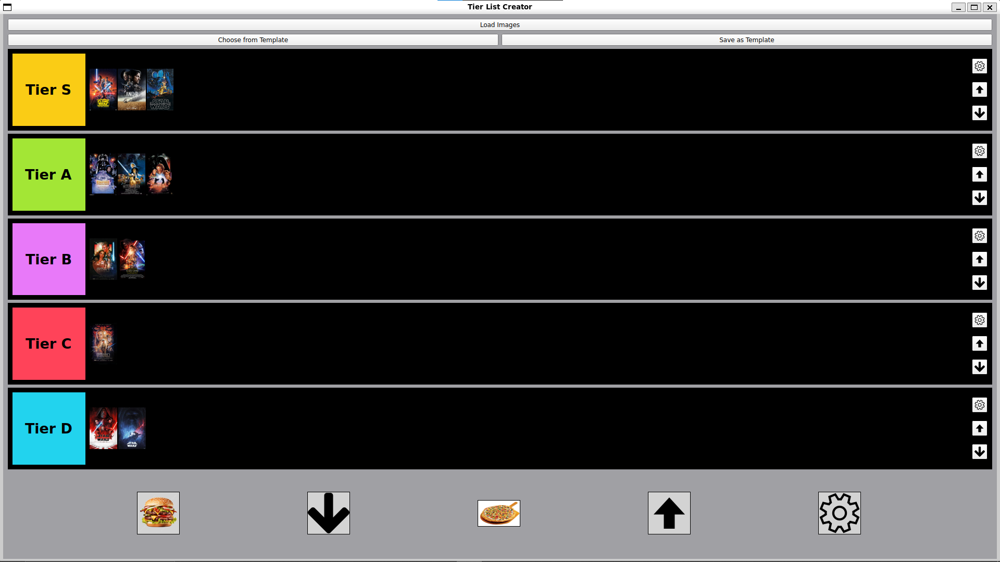

# Tier List App 


# 🎯 TierListApp

A sleek Qt-based Tier List Creator for ranking your favorite games, characters, food, or whatever you like!  
Customizable, visual, and powered by drag-and-drop.



---

## ✨ Features

- 🖼️ Load and rank your own images using drag-and-drop
- 🎨 Customize tier names and colors
- 💾 Save/load your tier lists as **JSON templates**
- 📁 Persistent image bank across tiers
- 🔼 Reorder tiers with one click
- ⚙️ Tier settings popup with color picker and rename
- 🔽 Scrollable UI with scalable layout

---

## 📸 Screenshots

> Place your screenshots in a `/screenshots` folder and name them logically (e.g., `demo.gif`, `editing.png`, `template-dialog.png`).

<!-- | Demo | Editing a Tier | Template Dialog |
|------|----------------|-----------------|
|  |  |  | -->

---

## 🛠️ Build Instructions

### 🧱 Dependencies

- Qt 5 or Qt 6 (`qtbase`, `qtwidgets`, etc.)
- CMake >= 3.16
- C++17 compatible compiler

### 💻 Build (Linux / WSL / Windows + VSCode)

```bash
git clone https://github.com/yourusername/TierListApp.git
cd TierListApp
mkdir build && cd build
cmake ..
make
./TierListApp